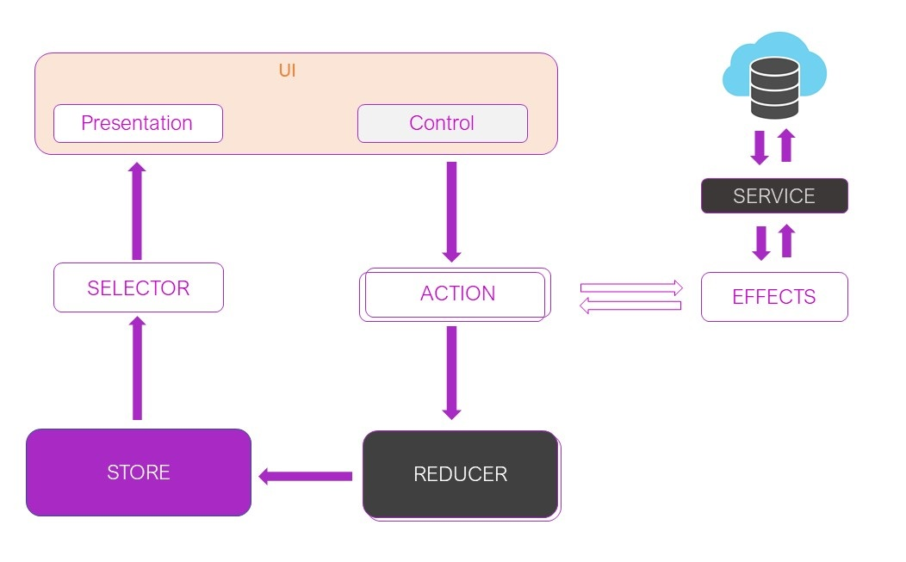
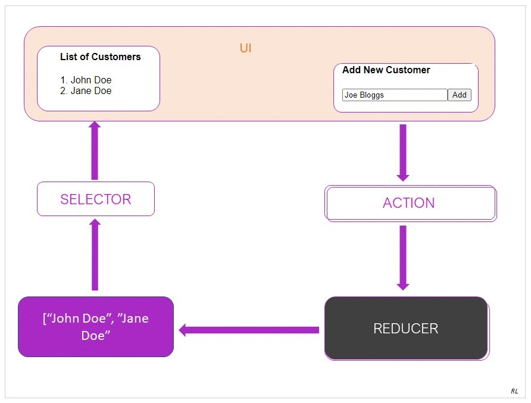

https://angulardeveloper.io/


# How to Upgrade the Angular CLI to the Latest Version

## To upgrade the Angular CLI to the latest version you can install it directly using the following command:

`npm install -g  @angular/cli@latest`


##Alternatively, if you run into issues, you might need to uninstall it and clear the cache:

```
npm uninstall -g angular-cli
npm cache clean or npm cache verify
npm install -g @angular/cli@latest
```

# Working with ES6 Modules

# The Initial Structure of an Angular App

# NgRx Course – Introduction & Redux

- Single source of truth (store)

- The state is read only (immutable, dispatching an Action)

- All changes in the state are made by pure functions called Reducers

# NgRx Course – Angular NgRx Setup

Ngrx Store: RxJS powered state management for Angular applications, inspired by Redux.

## NgRx App State Management
Let’s look at the NgRx implementation — there are several components to understand. 

### Store: 
The store is what holds the app's state. 

### Action: 
A unique event dispatched from components and services that describe how the state should be changed. For example, ‘Add Customer’ can be an action that will change the state (i.e. add a new customer to the list).

### Reducer: 
All the state changes happen inside the reducer; it responds to the action and, based on that action, it will create a new immutable state and return it to the store.

### Selector: 
Selector is a function used for obtaining a part of the state from the store.

### Effect: 
A mechanism that listens for dispatched actions in an observable stream, processes the server response, and returns new actions either immediately or asynchronously to the reducer to change the state. Please note that we are not using 'effect' in this example app.








## Ngrx Store: 

RxJS powered state management for Angular applications, inspired by Redux.


## NgRx is a collection of libraries to implement the Redux pattern in Angular applications:

### NgRx/store – the core library
### NgRx/effects – used to handle side effects such as communication with a back-end server
### NgRx/router-store – to connect the angular router to NgRx store
### NgRx/entity – used to manage record collections
### NgRx/store-devtools – allows us to inspect and debug the application
### NgRx/schematics – scaffolding library that provides CLI commands to generate files


